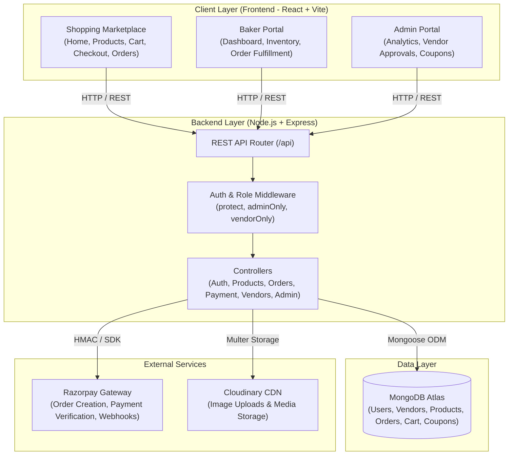
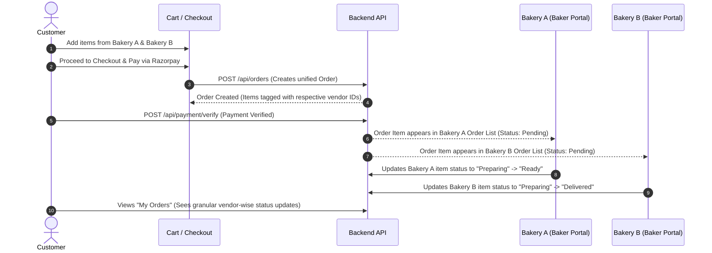
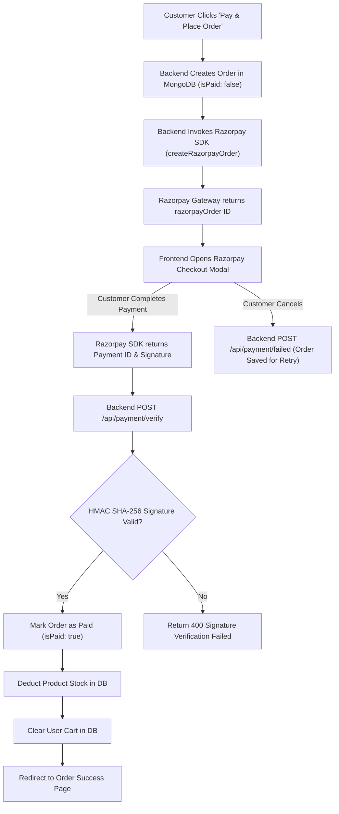

# 🍰 Cravory — Artisan Bakery & Dessert Marketplace

[](https://react.dev/)
[](https://vitejs.dev/)
[](https://nodejs.org/)
[](https://expressjs.com/)
[](https://www.mongodb.com/)
[](https://jwt.io/)
[](https://razorpay.com/)
[](https://cloudinary.com/)

**Cravory** is a full-stack multi-vendor artisan bakery and dessert marketplace built on the MERN stack. Designed to bridge local artisanal bakers and dessert lovers, Cravory provides an end-to-end e-commerce platform. Customers can discover local bakeries, explore freshly baked goods, build multi-vendor carts with stock-aware validation, apply promotional coupons, save delivery addresses, and seamlessly check out with Razorpay payment integration. Simultaneously, approved bakers gain access to a dedicated **Baker Portal** to manage inventory, fulfill customer orders, and maintain storefront details, while system administrators monitor marketplace analytics, onboard vendors, regulate user access, and maintain platform health through an **Admin Portal**.

---

## 🌟 Why Cravory?

Artisan bakeries and niche dessert craftsmen often struggle to compete with large commercial confectionery chains due to limited digital infrastructure and delivery reach. **Cravory** solves this problem by providing a centralized, multi-vendor marketplace tailored specifically for fresh bakery items:

- **For Customers**: Eliminates the hassle of navigating multiple standalone store sites by bringing diverse artisan bakeries, customizable pastries, and specialty cakes into a single unified storefront with secure checkout and real-time order status tracking.
- **For Artisan Bakers**: Eliminates high technology entry barriers by offering an intuitive self-service onboarding portal to publish menus, manage stock alerts, update fulfillment stages, and manage order items independently.
- **For Marketplace Operators**: Provides centralized governance tools to approve legitimate bakeries, moderate product listings, manage discount coupons, and review platform revenue metrics.

---

## ✨ Features

### 🛍️ Customer Features
- **User Authentication & Profiles**: Secure user registration, login, and JWT-based authentication with role assignment.
- **Marketplace & Bakery Discovery**: Homepage featuring banner showcases, category browsing (Cakes, Pastries, Cookies, Breads, Desserts), featured products, and a dedicated Bakery Directory page.
- **Product Search & Filtering**: Real-time keyword search, category filter badges, availability filters, and vendor-specific product catalogs.
- **Bakery Storefronts**: Dedicated landing pages for individual bakeries showcasing bakery cover imagery, description, address, contact details, average rating, and product catalog.
- **Rich Product Details**: Deep-dive product view displaying high-resolution image galleries, description, category, unit price, stock availability, baker information, customer reviews, and average rating breakdown.
- **Wishlist Management**: One-click product bookmarking with dedicated Wishlist management page.
- **Multi-Vendor Cart & Stock Management**: 
  - Dynamic cart calculation with vendor-wise item grouping.
  - Real-time stock validation preventing users from exceeding available inventory.
  - Quantity increment/decrement and item removal.
  - Multi-vendor cart notification allowing customers to purchase items across different bakeries in a single order session.
- **Address Book Management**: Save multiple shipping addresses with landmark details and select or set default delivery addresses during checkout.
- **Coupon & Discount Engine**: Apply valid promotional coupon codes at checkout with immediate subtotal discount recalculation.
- **Checkout & Order Creation**: Smooth checkout workflow integrating address selection, order summary preview, coupon application, and Razorpay checkout initiation.
- **My Orders & Item Tracking**:
  - Detailed order history listing subtotal, discount, final amount paid, delivery address, and timestamp.
  - Items grouped by vendor with per-item fulfillment status timelines (`pending` ➔ `confirmed` ➔ `preparing` ➔ `ready` ➔ `out_for_delivery` ➔ `delivered` / `cancelled`).
  - Payment status badges (Paid / Unpaid) with Razorpay payment retry capability for unpaid orders.
- **Product Reviews & Ratings**: Submit star ratings and text reviews for purchased baked goods.

### 👨‍🍳 Baker / Vendor Features
- **Baker Onboarding & Application**: Interactive "Become a Baker" onboarding page allowing users to submit bakery application details (Bakery Name, Description, Address, Phone, Email, Logo, Cover Image).
- **Approval Workflow Protection**: Strict role checks preventing unapproved vendors from creating products until verified by an Administrator.
- **Baker Portal & Dashboard**:
  - Storefront profile management (updating bakery details, images, and contact info).
  - Summary metrics displaying total products, active listings, total received orders, and pending fulfillment tasks.
- **Inventory & Product Management**:
  - Add new products with category selection, pricing, stock count, and direct Cloudinary image uploads.
  - Edit existing products, toggle stock availability, and update inventory counts.
  - Stock alerts highlighting low-stock items.
- **Customer Order Fulfillment**:
  - View incoming customer orders containing items produced by the vendor.
  - Granular item-level status updates (`confirmed`, `preparing`, `ready`, `out_for_delivery`, `delivered`, `cancelled`).

### 👑 Admin Features
- **Admin Portal & Guarded Routes**: Dedicated administrative portal protected by combined `protect` authentication and `adminOnly` role authorization middleware.
- **Marketplace Analytics & Overview Dashboard**:
  - Overview cards detailing Total Revenue, Total Orders, Total Registered Users, Active Vendors, and Total Products.
  - Fulfillment statistics breakdown across payment and order statuses.
- **Vendor Management**: Review vendor applications, approve pending bakeries, and activate/deactivate vendor storefronts.
- **Customer & User Management**: View registered user directory, manage user roles, and toggle user active status (`isActive`).
- **Product Catalog Moderation**: System-wide view of all published products with instant availability toggles (`isAvailable`).
- **Order Monitoring**: Global view of all marketplace orders, filterable by payment and fulfillment state.
- **Coupon Management**: Create and deactivate marketplace discount coupons (percentage or fixed discount type, minimum purchase requirement, maximum discount cap, per-user limit, and expiration date).

### 💳 Payments
- **Razorpay Payment Integration**: Integrated server-side Razorpay Order API creation and frontend Razorpay Checkout SDK trigger.
- **HMAC Signature Verification**: Server-side cryptographic HMAC SHA-256 validation verifying `razorpay_order_id`, `razorpay_payment_id`, and `razorpay_signature` before marking orders as paid and deducting product inventory.
- **Webhook Processing**: Public signature-verified webhook endpoint (`POST /api/payment/webhook`) handling `payment.captured` and `order.paid` events asynchronously.
- **Production Hardening**: Production mode requirement enforcing configured `RAZORPAY_KEY_SECRET` and `RAZORPAY_WEBHOOK_SECRET`, rejecting unverified or simulated transactions.
- **Payment Retry Workflow**: Ability for customers to re-initiate Razorpay payment directly from "My Orders" for existing unpaid orders.

### ☁️ Media & Storage
- **Cloudinary Integration**: Dynamic image uploading configured via `multer` and `multer-storage-cloudinary`.
- **Automated Cloud Storage**: Secure storage of product photos, bakery logos, and storefront banner cover images returning optimization-ready CDN links.

### 🎨 UI / UX
- **Theme & Palette**: Artisan bakery aesthetic built around warm strawberry/berry accent colors, crisp cream backgrounds, and elevated white cards.
- **Responsive Layouts**: Desktop grid displays with mobile-responsive collapse menus, sidebar drawers, and adaptable shopping tables.
- **State Feedback**: Integrated loading spinners, badge indicators, clear empty cart/wishlist placeholders, toast/alert alerts, and responsive error handling.

---

## 🏗️ System Architecture



---

## 🧰 Tech Stack

| Layer | Technology | Purpose |
| :--- | :--- | :--- |
| **Frontend** | React 19 | UI Component Architecture |
| | Vite 7 | Build Tooling & Local Dev Server |
| | React Router DOM 7 | Client-side Single Page App Routing |
| | Axios | Asynchronous HTTP Requests |
| | Bootstrap 5 | CSS Grid, Layout Utility & Responsive Framework |
| **Backend** | Node.js | Javascript Runtime Environment |
| | Express 5 | RESTful API Web Framework |
| | Mongoose 9 | MongoDB Object Data Modeling (ODM) |
| | JSON Web Token (JWT) | Stateless User Authentication |
| | BcryptJS | Secure Password Hashing |
| | Multer & Cloudinary | File Upload Parser & Image Cloud CDN |
| | Razorpay SDK | Online Payment Processing |
| **Database** | MongoDB Atlas | Cloud NoSQL Database |
| **Dev Tools** | ESLint 9 | Code Quality & Syntax Linting |
| | Nodemon | Development Server Auto-restart |

---

## 📁 Project Structure

```text
cravory-mern-ecommerce/
├── backend/
│   ├── config/
│   │   ├── db.js                 # MongoDB connection logic
│   │   ├── dns.js                # DNS fallback configuration
│   │   └── razorpay.js           # Razorpay instance factory
│   ├── controllers/
│   │   ├── addressController.js  # Customer address management
│   │   ├── adminController.js    # System dashboard, analytics & approval logic
│   │   ├── authController.js     # User registration, login & profile
│   │   ├── cartController.js     # Cart items sync & stock validation
│   │   ├── couponController.js   # Discount coupon creation & evaluation
│   │   ├── orderController.js    # Order placement, history & status updates
│   │   ├── paymentController.js  # Razorpay order, verification & webhook
│   │   ├── productController.js  # Product CRUD & image uploads
│   │   ├── reviewController.js   # Customer product reviews
│   │   ├── vendorController.js   # Vendor application & dashboard analytics
│   │   └── wishlistController.js # Product bookmarking logic
│   ├── middleware/
│   │   ├── adminMiddleware.js    # Admin role guard
│   │   ├── authMiddleware.js     # JWT verification middleware
│   │   ├── errorMiddleware.js    # Centralized API error handler
│   │   ├── uploadMiddleware.js   # Cloudinary multer upload middleware
│   │   └── vendorMiddleware.js   # Approved vendor role guard
│   ├── models/
│   │   ├── Address.js
│   │   ├── Cart.js
│   │   ├── Coupon.js
│   │   ├── Order.js
│   │   ├── Product.js
│   │   ├── Review.js
│   │   ├── User.js
│   │   ├── Vendor.js
│   │   └── Wishlist.js
│   ├── routes/
│   │   ├── addressRoutes.js
│   │   ├── adminRoutes.js
│   │   ├── authRoutes.js
│   │   ├── cartRoutes.js
│   │   ├── couponRoutes.js
│   │   ├── orderRoutes.js
│   │   ├── paymentRoutes.js
│   │   ├── productRoutes.js
│   │   ├── reviewRoutes.js
│   │   ├── vendorRoutes.js
│   │   └── wishlistRoutes.js
│   ├── .env.example
│   ├── package.json
│   └── server.js                 # Express app initialization & route registration
├── frontend/
│   ├── public/
│   ├── src/
│   │   ├── api/                  # Axios instance configuration
│   │   ├── components/           # Reusable UI components (Navbar, Footer, ProductCard, Guards)
│   │   ├── context/              # React Context state (AuthContext, CartContext)
│   │   ├── pages/                # Application views (Customer, Baker & Admin pages)
│   │   ├── utils/                # Helper utilities & currency formatters
│   │   ├── App.jsx               # Route definitions & layout wrappers
│   │   ├── index.css             # Main styling & custom design tokens
│   │   └── main.jsx              # React app entry point
│   ├── .env.example
│   ├── eslint.config.js
│   ├── package.json
│   └── vite.config.js
└── README.md
```

---

## 🔐 Authentication & Authorization

Cravory implements a robust stateless authentication scheme using JSON Web Tokens (JWT):

1. **Password Hashing**: User passwords are encrypted using `bcryptjs` before persistence.
2. **Token Generation**: Upon successful login or registration, the backend signs a JWT containing the user's `id` and `role`.
3. **Role-Based Authorization**:
   - `user`: Standard customer access to storefront, cart, address book, orders, and wishlist.
   - `vendor`: Access to Baker Portal pages, product creation, stock updates, and store order fulfillment (requires `isApproved: true` on the associated `Vendor` record).
   - `admin`: Full system control including user regulation, vendor approvals, product moderation, coupon issuance, and analytical insights.
4. **Middleware Protection**:
   - `protect`: Extracts the `Bearer` token from the HTTP Authorization header, verifies signature, and attaches the user document to `req.user`.
   - `vendorMiddleware`: Validates that `req.user.role === 'vendor'` and verifies that the associated `Vendor` profile exists and has `isApproved === true`.
   - `adminMiddleware`: Validates that `req.user.role === 'admin'`.

---

## 🗄️ Database Schemas & Entities

The platform uses 9 MongoDB schemas linked via Mongoose references:

- **User**: Core identity model storing `name`, `email`, `password`, `role` (`user` | `vendor` | `admin`), and `isActive`.
- **Vendor**: Storefront entity linked to a `User` containing `bakeryName`, `description`, `phone`, `email`, `logo`, `coverImage`, `address`, `city`, `state`, `pincode`, `location`, `isApproved`, `rating`, `numReviews`, and `isActive`.
- **Product**: Baked items linked to both `createdBy` (`User`) and `vendor` (`Vendor`), capturing `name`, `description`, `price`, `category`, `stock`, `images` array (`url`, `public_id`), `rating`, `numReviews`, and `isAvailable`.
- **Order**: Master transaction record tracking `user`, `orderItems` (array storing `name`, `qty`, `price`, `product`, `vendor` ref, and per-item `status`), `subtotal`, `discountAmount`, `coupon`, `totalPrice`, `shippingAddress`, `paymentMethod`, `isPaid`, `paidAt`, `razorpayOrderId`, and `paymentResult`.
- **Cart**: User's shopping cart storing `user` reference and `cartItems` array (`product`, `qty`, `vendor`).
- **Wishlist**: Bookmarked items for a `user`.
- **Address**: Saved customer shipping addresses containing address fields and `isDefault` flag.
- **Coupon**: Promotional codes storing `code`, `discountType` (`percentage` | `flat`), `discountValue`, `minOrderAmount`, `maxDiscountAmount`, `validUntil`, and `isActive`.
- **Review**: Product reviews containing `user`, `product`, `rating`, `comment`, and verified purchase status.

---

## 🛒 Multi-Vendor Order Architecture

Cravory natively handles multi-vendor ordering where a single customer cart can contain items produced by different bakeries:



1. **Vendor Tagging**: Every item added to the cart and saved to an order carries a reference to its producing `vendor`.
2. **Cart Display**: Items in the cart are visually grouped by bakery name.
3. **Fulfillment Separation**: When an order is placed, each baker sees only the order items belonging to their bakery inside their **Baker Portal**.
4. **Independent Status Management**: Bakers update fulfillment for their respective items independently without impacting other items in the same customer order.

---

## 💰 Payment Flow



---

## 🔄 Order Lifecycle

Each item within an order transitions through the following statuses defined in the `Order` model:

```text
[ pending ] ──► [ confirmed ] ──► [ preparing ] ──► [ ready ] ──► [ out_for_delivery ] ──► [ delivered ]
     │
     └──► [ cancelled ]
```

- **pending**: Default status upon order placement awaiting payment/vendor acknowledgment.
- **confirmed**: Order accepted by the vendor.
- **preparing**: Baked goods are currently in production.
- **ready**: Order is packaged and ready for pickup/dispatch.
- **out_for_delivery**: Courier or delivery agent has picked up the package.
- **delivered**: Package successfully handed over to the customer.
- **cancelled**: Item cancelled due to stock unavailability or customer request.

---

## 🧑‍💻 Local Development

### Prerequisites
- **Node.js**: v18.x or higher
- **npm**: v9.x or higher
- **MongoDB**: Local instance or MongoDB Atlas connection string
- **Cloudinary Account**: For handling product and vendor image uploads (optional in dev mode)
- **Razorpay Test Account**: Key ID and Key Secret for test payments

### 1. Clone Repository
```bash
git clone https://github.com/Akshatha2312/cravory-mern-ecommerce.git
cd cravory-mern-ecommerce
```

### 2. Backend Setup
```bash
cd backend
npm install --legacy-peer-deps
```

Create a `.env` file in the `backend/` root directory:
```env
PORT=4000
NODE_ENV=development
MONGO_URI=mongodb+srv://<username>:<password>@<cluster>.mongodb.net/cravory?appName=Cluster0
JWT_SECRET=your_jwt_secret_key_here
FRONTEND_URL=http://localhost:5173

# Razorpay Test Mode Credentials
RAZORPAY_KEY_ID=rzp_test_your_key_id
RAZORPAY_KEY_SECRET=your_razorpay_secret_here
RAZORPAY_WEBHOOK_SECRET=your_webhook_secret_here

# Cloudinary Configuration
CLOUDINARY_CLOUD_NAME=your_cloud_name
CLOUDINARY_API_KEY=your_api_key
CLOUDINARY_API_SECRET=your_api_secret
```

Start the backend development server:
```bash
npm run dev
```
The server will run on `http://localhost:4000`.

### 3. Frontend Setup
In a new terminal window:
```bash
cd frontend
npm install
```

Create a `.env` file in the `frontend/` root directory:
```env
VITE_API_URL=http://localhost:4000/api
VITE_RAZORPAY_KEY_ID=rzp_test_your_key_id
```

Start the frontend Vite development server:
```bash
npm run dev
```
The application will be accessible at `http://localhost:5173`.

---

## 🌐 Production Deployment

The project is structured for seamless cloud deployment:

```text
[ React + Vite Frontend ] ──► Deployed on Vercel
           │
           ▼
[ Express Node.js API ]   ──► Deployed on Render (https://cravory-mern-ecommerce.onrender.com)
           │
           ├──► MongoDB Atlas (Cloud NoSQL Database)
           ├──► Cloudinary CDN (Media & Image Storage)
           └──► Razorpay Payment Gateway (Online Transactions)
```

- **Frontend Deployment (Vercel)**: Deployed with SPA rewrite rules (`vercel.json`) routing all path traffic to `index.html`.
- **Backend Deployment (Render)**: Hosted as a Node.js Web Service running `node server.js` with production CORS headers configured via `FRONTEND_URL`.
- **Database (MongoDB Atlas)**: Managed MongoDB cloud cluster with network access rules permitting backend IP connections.

---

## 🚀 Deployment Environment Variables

### Frontend Environment Variables
| Variable | Required | Description |
| :--- | :--- | :--- |
| `VITE_API_URL` | Yes | Complete URL of the backend API endpoint (e.g., `https://cravory-mern-ecommerce.onrender.com/api`). |
| `VITE_RAZORPAY_KEY_ID` | Yes | Public Razorpay Key ID used by the frontend SDK modal. |

### Backend Environment Variables
| Variable | Required | Description |
| :--- | :--- | :--- |
| `PORT` | Optional | Port on which Express server listens (defaults to `4000`). |
| `NODE_ENV` | Yes | Application environment (`development` or `production`). Controls strict signature checks. |
| `MONGO_URI` | Yes | MongoDB Atlas database connection URI string with credentials. |
| `JWT_SECRET` | Yes | Secret cryptographic key used to sign and verify JWT authentication tokens. |
| `FRONTEND_URL` | Yes | Production URL of the frontend web application for CORS policy validation. |
| `RAZORPAY_KEY_ID` | Yes | Key ID generated from Razorpay Dashboard. |
| `RAZORPAY_KEY_SECRET` | Yes | Key Secret generated from Razorpay Dashboard for HMAC signature checks. |
| `RAZORPAY_WEBHOOK_SECRET` | Production | Webhook secret configured in Razorpay Dashboard for verifying raw webhook payloads. |
| `CLOUDINARY_CLOUD_NAME` | Yes | Cloudinary Cloud Account name. |
| `CLOUDINARY_API_KEY` | Yes | Cloudinary API access key. |
| `CLOUDINARY_API_SECRET` | Yes | Cloudinary API access secret. |

---

## 🧪 Testing & Quality Assurance

- **Code Quality**: Clean syntax adhering to ESLint 9 configuration rules across frontend code.
- **Production Build Validation**: Verified client bundle generation via `vite build` without errors.
- **Backend Import Validation**: Verified ES Module imports and route registration across Node.js controllers.
- **Regression Testing**: Manual end-to-end verification of customer cart flow, vendor status updates, and payment signature validation performed during development iterations.

---

## 🛡️ Security Considerations

1. **Zero Secret Exposure**: Environment secrets (`.env`) are excluded via `.gitignore` and never committed to version control.
2. **Cryptographic Signature Verification**: Payments require HMAC SHA-256 calculation matching Razorpay headers before updating order status.
3. **Password Security**: Salted hashing via `bcryptjs` guarantees raw passwords are never logged or stored.
4. **CORS Restriction**: Backend API dynamically restricts cross-origin HTTP access to the trusted `FRONTEND_URL` in production environments.
5. **Role-Based Endpoint Guards**: Route-level express middleware (`protect`, `vendorMiddleware`, `adminMiddleware`) enforces authorization at the server boundary.

---

## 📊 Project Highlights

- **Complete MERN E-Commerce Architecture**: End-to-end implementation spanning React 19, Express 5, Node.js, and MongoDB.
- **Multi-Role Portal System**: Distinct views and capabilities tailored for Customers, Bakers, and Marketplace Administrators.
- **Multi-Vendor Basket Handling**: Supports items from multiple bakeries in a single cart session with vendor-wise order status updates.
- **Production-Grade Payment Pipeline**: Secure Razorpay integration equipped with signature verification, failure handling, and payment retries.
- **Cloud-Native Media Uploads**: Instant image optimization and hosting via Cloudinary CDN.
- **Live Cloud Deployment**: Deployed across Vercel, Render, and MongoDB Atlas.

---

## 🎯 Future Improvements

- [ ] **Automated Testing Suite**: Integration of Jest and React Testing Library for frontend component testing and Supertest for API routes.
- [ ] **Real-Time Push Notifications**: WebSocket (Socket.io) integration to send instant order alerts to baker dashboards and live status updates to customers.
- [ ] **Advanced Delivery Tracking**: Interactive map integration (Leaflet/Mapbox) for tracking delivery riders.
- [ ] **Email & SMS Transactional Alerts**: Integration with Nodemailer/SendGrid for sending email order receipts.

---

## 📸 Screenshots

*(Screenshots of Customer Marketplace, Product Details, Cart, Baker Portal, and Admin Dashboard can be added here)*

---

## 👨‍💻 Author

**Akshatha**
- **GitHub**: [@Akshatha2312](https://github.com/Akshatha2312)

---

## 📌 Important Notes

- **Razorpay Credentials**: Currently configured for **Test Mode**. Ensure real test card/UPI details are used when testing payments locally.
- **Environment Setup**: Always copy `.env.example` to `.env` in both `frontend` and `backend` directories before running the app.
- **MongoDB IP Whitelist**: Ensure your current IP address (or `0.0.0.0/0` for cloud services like Render) is added to your MongoDB Atlas Network Access rules.
